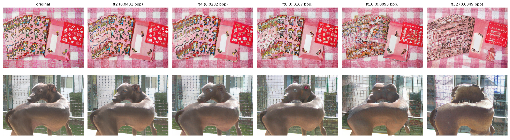

# AEIC on ImageNet-1k — Ultra-Low Bitrate Perceptual Image Compression with a Shallow Encoder

Course project (Multimedia Systems) — running and evaluating the CVPR 2026 paper
**[Ultra-Low Bitrate Perceptual Image Compression with Shallow Encoder](https://arxiv.org/pdf/2512.12229v2)**
(Zhang, Liu, Chen) on the **ImageNet-1k validation set**, a dataset not covered in the original paper.

Official implementation: [LuizScarlet/AEIC](https://github.com/LuizScarlet/AEIC) (used with its released pretrained checkpoints; no retraining).

**Authors:** Benjamin Hadžihasanović, Tarik Čaluk

## What's here

| Path | Contents |
|---|---|
| [`AEIC_ImageNet_Colab.ipynb`](AEIC_ImageNet_Colab.ipynb) | Complete, self-contained Google Colab notebook: environment setup, code patches, model/dataset download, compression at 5 rate points, evaluation, plots, JPEG baseline |
| [`documentation/`](documentation/) | IEEE-format report ([PDF](documentation/aeic_imagenet_ieee.pdf), LaTeX source, figures) |
| [`presentation/`](presentation/) | 10-slide Beamer presentation ([PDF](presentation/aeic_slides.pdf), LaTeX source) |
| [`results/`](results/) | Measured metrics (CSV/JSON) and result figures |

## Results (AEIC-SE, 500 ImageNet-1k val images, shorter side ≥ 256 px)

| ckpt | bpp | PSNR | MS-SSIM | LPIPS | DISTS | FID | KID |
|---|---|---|---|---|---|---|---|
| ft32 | 0.0049 | 17.71 | 0.576 | 0.374 | 0.202 | 60.1 | 0.0064 |
| ft16 | 0.0093 | 18.86 | 0.657 | 0.299 | 0.169 | 48.4 | 0.0029 |
| ft8 | 0.0167 | 19.99 | 0.728 | 0.237 | 0.144 | 39.6 | 0.0015 |
| ft4 | 0.0282 | 20.97 | 0.786 | 0.190 | 0.122 | 31.5 | 0.0006 |
| ft2 | 0.0431 | 21.75 | 0.825 | 0.157 | 0.106 | 26.5 | −0.0002 |
| **JPEG q=1** | **0.1915** | 21.07 | 0.809 | 0.547 | 0.411 | 151.5 | 0.0651 |

Key findings (details and interpretation in the [report](documentation/aeic_imagenet_ieee.pdf)):

- The codec **generalizes**: all metrics improve monotonically with rate, with the same curve shapes as the paper's Kodak/CLIC benchmarks.
- **Small-image overhead**: bpp is ~50% higher than on CLIC 2020 at the same checkpoint (fixed hyper-latent + padding costs over ~0.2 MP images).
- **JPEG cannot reach this regime**: at its minimum quality it still spends 4.4× the bits of the highest AEIC rate point with similar PSNR but drastically worse perceptual quality — PSNR alone misleads at extreme rates.
- **Subjectively**, reconstructions down to 0.009 bpp are hard to distinguish from the original at normal viewing distance; at 0.005 bpp hallucinated details are visible at any distance.
- Real entropy-coded bitstreams measure 0.0180 bpp vs. 0.0167 estimated at the ft8 point (~7% header/rANS overhead).

## How to run

1. Open `AEIC_ImageNet_Colab.ipynb` in [Google Colab](https://colab.research.google.com), set **Runtime → Change runtime type → T4 GPU**.
2. (Recommended) Accept the ImageNet terms at [ILSVRC/imagenet-1k](https://huggingface.co/datasets/ILSVRC/imagenet-1k) and create a [HF read token](https://huggingface.co/settings/tokens); the notebook asks for it (Enter skips to an ungated mirror).
3. **Runtime → Run all** (~1.5–2 h on a free T4 for 500 images × 5 checkpoints).

## Modifications to the original code

All patches are applied automatically (and idempotently) by the notebook:

1. `compress.py` — the rANS CDF-table build (which requires the compiled C++ engine) is guarded behind `--use_practical_entropy_coding`; without the flag, bpp is estimated from entropy-model likelihoods (verified against real bitstreams, ~7% gap).
2. `testing_utils.py` — xformers attention off → PyTorch SDPA.
3. `testing_utils.py` — `torch.compile` off (ImageNet resolutions vary → constant recompilation).
4. `evaluate.py` — `neuralcompression` (no longer buildable on Colab) replaced by a faithful local port of `update_patch_fid` (FID/256 protocol, Mentzer et al. 2020).
5. `evaluate.py` — KID `subset_size` 1000 → 50 (small images yield only 1–2 patches of 256 px each).

For the optional entropy-coder build: fetched pybind11 bumped v2.10.4 → v2.13.6 (the pin predates Python 3.12) and `-Werror` stripped (newer g++ warnings).

## Credits

Model, training and evaluation code: [AEIC](https://github.com/LuizScarlet/AEIC) (MIT license).
Backbone: [SD-Turbo](https://huggingface.co/stabilityai/sd-turbo); pruned VAE decoder: [AdcSR](https://huggingface.co/Guaishou74851/AdcSR).
Evaluation protocol follows [MS-ILLM](https://github.com/facebookresearch/NeuralCompression).
